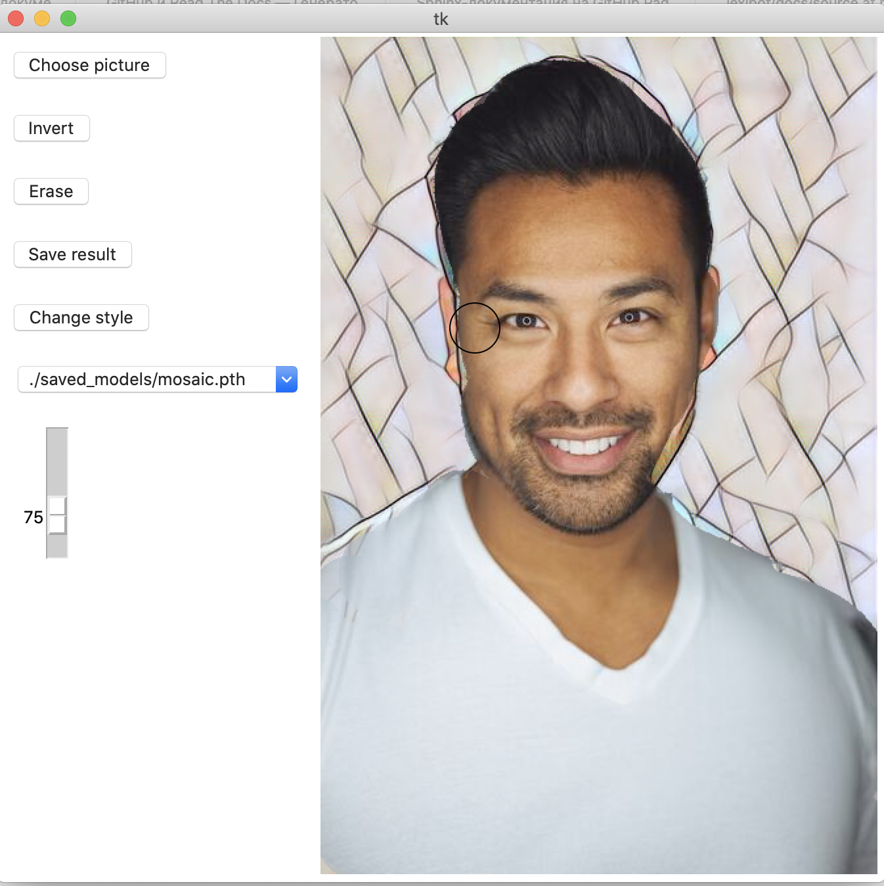

# project-pythondevelopment2021

# Постановка задачи

Создание приложения, позволяющего стилизовать фотографии заранее предобученной нейросетью и выделять область изображения, которую нужно стилизовать.

# Инструкция для запуска

python3 download_saved_models.py
python3 main.py

# Интерфейс

​

В правой части интерфейса находится интерактивное изображение, в левой - панель управления. 
Для загрузки изображения нажмите кнопку «Choose picture» 
Для выделения области необходимо левой кнопкой мыши нарисовать на изображении требуемую область. Правой кнопкой мыши можно стирать нарисованные части изображения. Также можно инвертировать изображение с помощью кнопки «Invert». При этом выделенная область сохраняется 
Для регулирования  размера кисти необходимо прокрутить колесико мыши. Ползунок слева отвечает за интенсивность нажатия. 

Для изменения используемого стиля необходимо в выпадающем окне выбрать нужный и нажать кнопку «Change style»
Для отмены всех изменений нажать кнопку «Erase»

Для сохранения полученного изображения нажмите кнопку «Save result»
